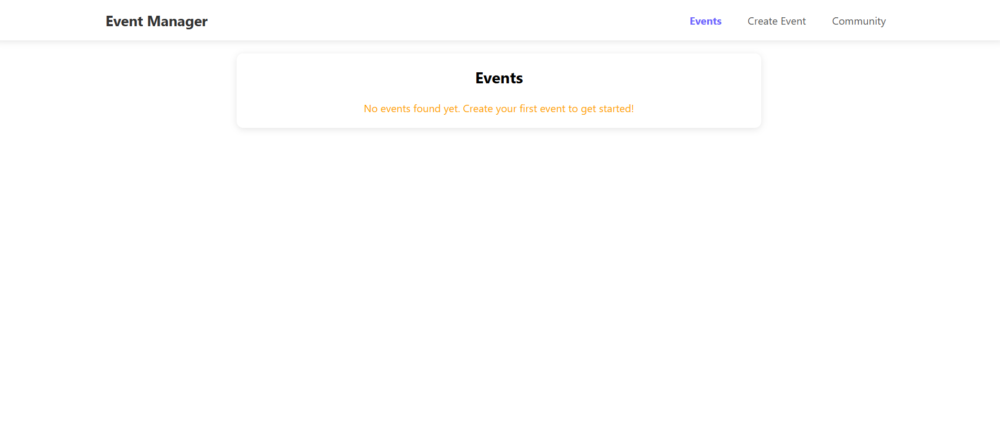
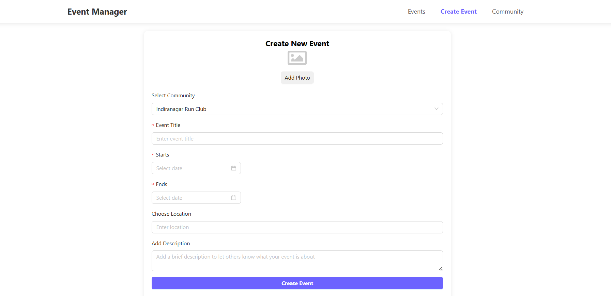
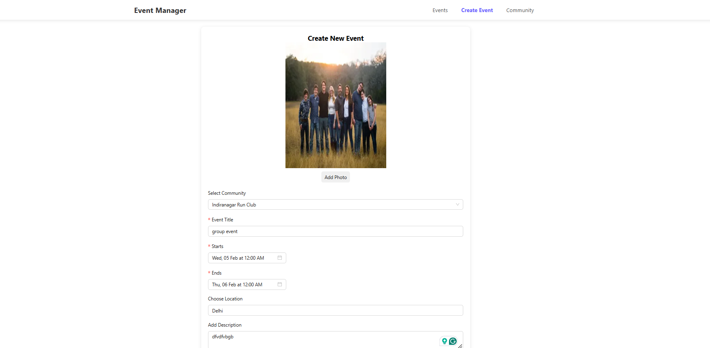
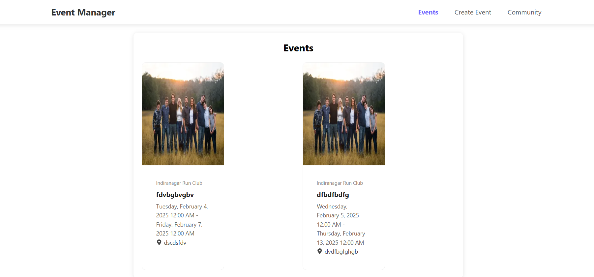

# Event Manager

## Project Overview

The **Event Manager** is a web application designed to help users manage and organize events. The application allows users to create and manage events, including form inputs for event details, communities, and image uploads. The app provides a simple and intuitive interface to streamline the event management process.

You can view the live demo of the project [here](https://event-manager-ruddy.vercel.app/).

## Implementation Choices

- **React**: Chosen for its component-based architecture, making the app modular and easy to manage.
- **SCSS**: Used for styling to take advantage of features like variables, nesting, and mixins, which makes the stylesheets more organized and maintainable.
- **React Hooks**: Custom hooks like `useLocalStorage` and `useMediaUpload` were implemented to abstract and reuse logic across different components.

## Libraries/Technologies Used

- **React.js** (`^19.0.0`) - A JavaScript library for building user interfaces, used for component-based development.
- **React DOM** (`^19.0.0`) - Provides DOM-specific methods for React to interact with the browser.
- **React Router DOM** (`^7.1.5`) - A library for managing routing and navigation in React applications.
- **Ant Design (AntD)** (`^5.23.3`) - A comprehensive UI component library for React, used for building rich and interactive UIs.
- **Sass** (`^1.83.4`) - A CSS preprocessor, used for writing more maintainable and structured CSS with features like variables, mixins, and nesting.
- **Day.js** (`^1.11.13`) - A lightweight JavaScript library for working with dates and times.
- **Date-fns** (`^4.1.0`) - A modern JavaScript date utility library for formatting, parsing, and manipulating dates.
- **React Icons** (`^5.4.0`) - A library to include popular icons in React applications.
- **React DatePicker** (`^7.6.0`) - A customizable date picker component for React.
- **@testing-library/react** (`^13.0.0`) - A set of utilities for testing React components.
- **@testing-library/jest-dom** (`^5.14.1`) - Custom jest matchers for testing DOM elements in React applications.
- **@testing-library/user-event** (`^13.2.1`) - Simulates user interactions for testing React components.
- **Web Vitals** (`^2.1.0`) - A library to measure key performance metrics of the web app.

## Challenges Faced

- **Image Upload Handling**: Implementing a clean and efficient image upload solution that works seamlessly with React required additional handling for file validation and asynchronous uploads.

## Screenshots





## Demo Video 

[video](https://drive.google.com/file/d/1vX5bVgxWHXbeEoVYHpBh2onn8BEGREqh/view?usp=sharing)

## Installation and Setup Instructions

1. Clone the repository:

   ```bash
   git clone https://github.com/vikasdev66/event-manager.git
   cd event-manager
   ```
